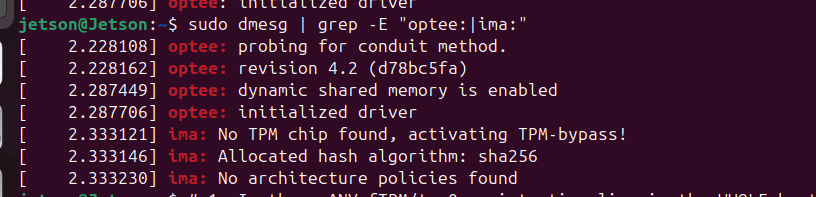
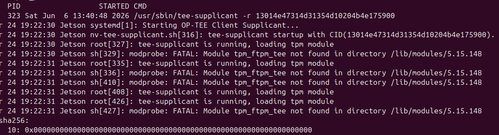
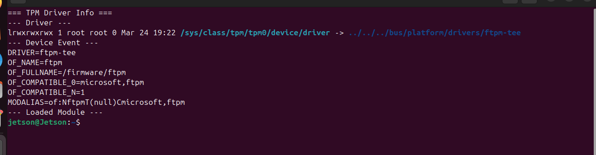
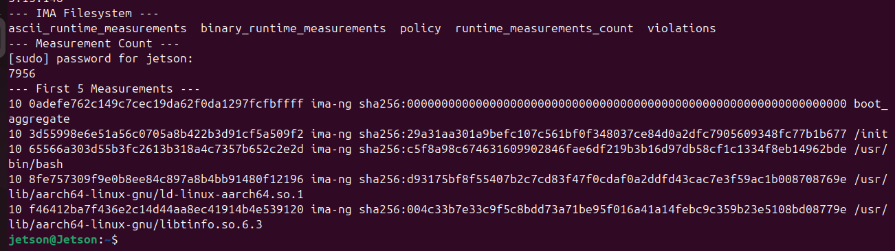
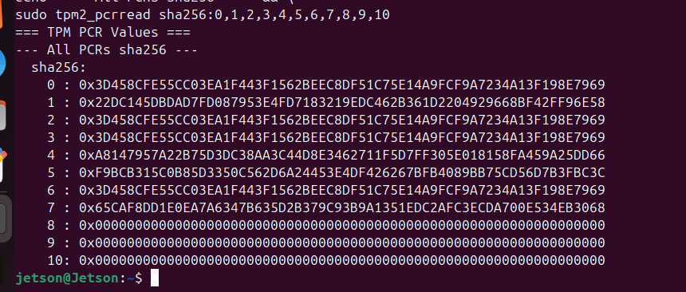
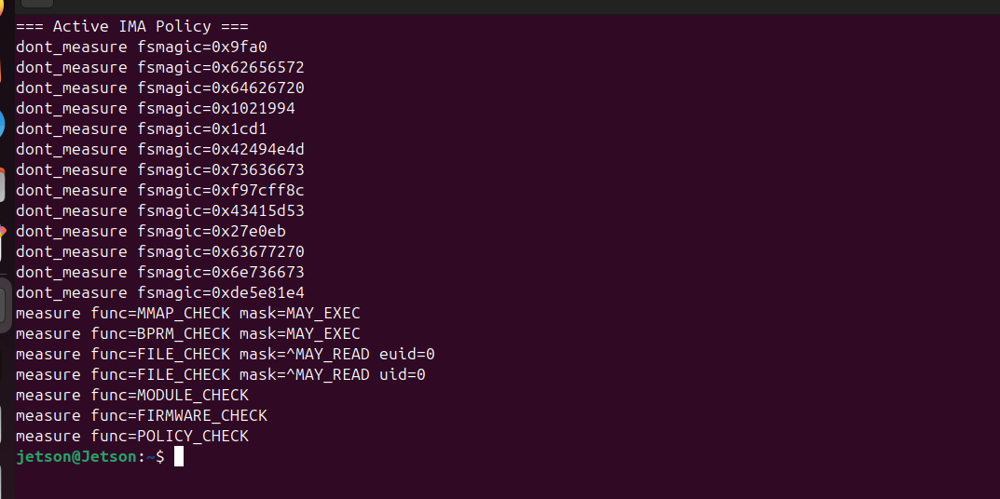

# Remote Attestation on NVIDIA Jetson AGX Orin using OP-TEE and IMA

> **Platform:** NVIDIA Jetson AGX Orin Developer Kit  
> **Kernel:** 5.15.148 (custom build with IMA enabled)  
> **JetPack:** R36.4.4  
> **TEE:** OP-TEE 4.2  
> **TPM:** Microsoft fTPM (firmware TPM inside OP-TEE)

---

## Overview

This repository documents the design, implementation, and findings of a
remote attestation system on NVIDIA Jetson AGX Orin. The system allows a
remote verifier to request cryptographic proof of the device's software
state — what kernel is running, which modules are loaded, and whether the
platform is correctly configured.

The work is built on three components:

- **IMA (Integrity Measurement Architecture)** — Linux kernel subsystem
  that measures every binary, module, and firmware blob at runtime
- **fTPM (firmware TPM)** — Microsoft's TPM 2.0 implementation running
  as a Trusted Application inside OP-TEE
- **OP-TEE** — ARM TrustZone-based Trusted Execution Environment that
  holds the attestation signing key and signs evidence

---

## Key Finding — fTPM + IMA Initialization Ordering Problem

During implementation, a fundamental architectural conflict was discovered
between IMA and fTPM on Jetson AGX Orin.

### The Problem

```
[3.824s] optee: initialized driver                      ← OP-TEE core ready
[3.896s] ima: No TPM chip found, activating TPM-bypass!  ← IMA runs AFTER, still no TPM
```

IMA initializes (at `late_initcall`) and looks for a TPM. Even though OP-TEE
core is already up, **the fTPM is not yet registered** — it is brought up later
by the userspace `tee-supplicant` daemon, because it relies on supplicant-mediated
RPMB storage. So IMA finds no TPM, latches into bypass mode permanently, and IMA
measurements are never extended into PCR[10].

Note that OP-TEE core is already up (3.824s) *before* IMA's lookup (3.896s) —
yet IMA still finds no TPM. The cause is not an OP-TEE-vs-IMA timing race; it is
an invariant **kernel-init-vs-userspace** ordering, because the fTPM is brought
up from userspace. Full analysis:
[docs/root-cause-analysis.md](docs/root-cause-analysis.md).


*OP-TEE core is initialized before IMA runs, yet IMA finds no TPM — proving fTPM-ready ≠ OP-TEE-ready.*


*Stock `nv-tee-supplicant.sh` brings up the fTPM from userspace, after tee-supplicant — long after IMA's kernel-init lookup. (The `modprobe FATAL` lines are harmless: the driver is built in via `CONFIG_TCG_FTPM_TEE=y`.)*

### Why This Happens

On Jetson AGX Orin, there is no physical TPM chip. Instead, TPM 2.0 is
implemented as Microsoft's fTPM Trusted Application running inside OP-TEE.

```
Physical TPM (other platforms):
  Separate chip, powered independently
  Ready at power-on → IMA always finds it ✅

fTPM on Jetson (this platform):
  Software TA inside OP-TEE, backed by eMMC RPMB storage
  Module is DENYLISTED from kernel-init autoload (NVIDIA config)
  Loaded from USERSPACE by nv-tee-supplicant.service,
    only after tee-supplicant is up and RPMB is ready (~3.4s)
  IMA's one-shot lookup runs in kernel init, BEFORE userspace ❌
```

It is **not** that OP-TEE "comes up too late." NVIDIA *deliberately* keeps the
fTPM out of kernel init: `/etc/modprobe.d/denylist-tpm-ftpm-tee.conf` blacklists
the module, and `nv-tee-supplicant.service` loads it by hand from userspace once
tee-supplicant (and its RPMB backing store) are ready. IMA's `late_initcall`
lookup runs entirely within kernel init, so it can never see the chip. The fTPM
is architected for a userspace, EKB-provisioned attestation flow — structurally
incompatible with kernel-space IMA. Full detail (with verbatim config) in
[docs/root-cause-analysis.md](docs/root-cause-analysis.md).


*Confirms TPM is driven by ftpm-tee (firmware, not physical chip) with compatible = microsoft,ftpm*

This same class of problem appears across multiple ARM platforms (though the
Jetson cause — a deliberate userspace denylist + RPMB dependency — is its own
variant). See related issues:

- [OP-TEE issue #7248](https://github.com/OP-TEE/optee_os/issues/7248) — fTPM + IMA on Xilinx ZCU104
- [Raspberry Pi Linux issue #3291](https://github.com/raspberrypi/linux/issues/3291) — IMA/TPM load order broken
- [Cybersecurity-LINKS patch](https://github.com/Cybersecurity-LINKS/tpm-ima-patch) — Fix for RPi 5.15.y (merged into RPi kernel, not mainline)
- [LKML patch 2021](https://lkml.rescloud.iu.edu/2101.1/10112.html) — fTPM: make sure TEE is initialized before fTPM
- [TI TDA4VM forum](https://e2e.ti.com/support/processors-group/processors/f/processors-forum/1375425/tda4vm-ima-vs-tpm-builtin-driver-boot-order) — Same issue on TI platform

**This is a known, upstream-acknowledged OP-TEE limitation (reported since
2022, see [evidence/upstream-prior-art.md](evidence/upstream-prior-art.md)) —
not a novel discovery.** What this repository adds is a detailed, evidence-backed
characterization of how it manifests on **NVIDIA Jetson AGX Orin (JetPack
R36.4.4)** — including the platform-specific load mechanism (module denylist +
`nv-tee-supplicant.service`) — and an evaluation of the available workarounds.

---

## Platform Details

| Property | Value |
|---|---|
| Device | NVIDIA Jetson AGX Orin Developer Kit |
| JetPack | R36.4.4 |
| Kernel | 5.15.148 (OOT variant, rebuilt with IMA) |
| OP-TEE | 4.2 (d78bc5fa) |
| TPM type | firmware TPM (microsoft,ftpm) |
| TPM driver | tpm_ftpm_tee |
| Storage | eMMC 59.3G (mmcblk0) |
| RAM | 64GB |

---

## Architecture

```
┌─────────────────────────────────────────────────────────────┐
│                    Jetson AGX Orin                          │
│                                                             │
│  Normal World                  Secure World (OP-TEE)        │
│  ──────────────                ─────────────────────        │
│                                                             │
│  Linux kernel                  fTPM TA                      │
│    │                             │                          │
│    IMA subsystem                 PCR[0..23] variables        │
│    measures files                                           │
│    │                           Attestation TA (planned)     │
│    Normal World Agent            │                          │
│    │ (dumb pipe)                 reads PCR[0-7]             │
│    │                             reads IMA log hash         │
│    sends nonce ────────────────► reads ECID + fuse state    │
│                                  signs with private key      │
│    receives token ◄──────────────│                          │
│    │                                                        │
│    forwards to verifier                                     │
└─────────────────────────────────────────────────────────────┘
```

---

## Evidence

### IMA Running — 6024 Measurements at Boot


*IMA filesystem present, 6024 measurements recorded, first 5 entries shown*

### TPM PCR Values — Boot Chain Measured, PCR[10] = 0


*PCR[0-7] extended by EDK2 firmware (non-zero), PCR[10] = all zeros (IMA bypass)*

### Active IMA Policy


*tcb policy active — measures all executed binaries, kernel modules, and firmware*

---

## What Is Attested

### Boot Chain — PCR[0-7] (firmware measured, stored in fTPM)

EDK2 UEFI firmware measures the boot chain before the kernel starts
and extends values into fTPM PCRs:

```
PCR[0] = 0x3D458CFE55CC03EA...  ← UEFI firmware hash
PCR[1] = 0x22DC145DBDAD7FD0...  ← UEFI configuration
PCR[4] = 0xA8147957A22B75D3...  ← bootloader hash
PCR[7] = 0x65CAF8DD1E0EA7A6...  ← secure boot state
PCR[10]= 0x0000000000000000...  ← IMA not extending (fTPM userspace-gated)
```

These are hardware-enforced. The kernel cannot modify them.

### Runtime — IMA Measurement Log (kernel space)

IMA measures every binary and module as it executes:

```
10  0adefe76...  ima-ng  sha256:000...000  boot_aggregate
10  3d55998e...  ima-ng  sha256:29a31aa3...  /init
10  65566a30...  ima-ng  sha256:c5f8a98c...  /usr/bin/bash
10  8fe75730...  ima-ng  sha256:d93175bf...  /usr/lib/ld-linux-aarch64.so.1
...
```

**6000+ measurements** recorded per boot. Userspace cannot fake these
entries — IMA runs in kernel space.

### Device Identity — Hardware registers (TEE reads directly)

- ECID (Electronic Chip ID) — unique per device, from Security Engine
- Fuse state — ODM production mode, secure boot configuration

---

## Current Status

| Component | Status | Notes |
|---|---|---|
| IMA enabled | ✅ Working | 6000+ measurements per boot |
| IMA policy (tcb) | ✅ Active | Measures binaries, modules, firmware |
| fTPM accessible | ✅ Working | /dev/tpm0, tpm2_pcrread works |
| PCR[0-7] | ✅ Non-zero | Firmware-extended boot measurements |
| PCR[10] extension | ❌ Not working | fTPM userspace-gated; unavailable at IMA init |
| OP-TEE TA | 🔄 In progress | Attestation TA being built |
| Normal World agent | 🔄 Planned | |
| Verifier | 🔄 Planned | |

---

## Enabling IMA — Build Steps

### Prerequisites

```bash
# verify IMA is not enabled on your Jetson
zcat /proc/config.gz | grep "CONFIG_IMA"
# should show: # CONFIG_IMA is not set
```

### Step 1 — Extract kernel source

```bash
mkdir -p ~/kernel_build
cd ~/kernel_build
tar -xjf ~/Linux_for_Tegra/source/kernel_src.tbz2
tar -xjf ~/Linux_for_Tegra/source/kernel_oot_modules_src.tbz2
```

### Step 2 — Get current running config as base

```bash
cd ~/kernel_build/kernel/kernel-jammy-src/
zcat /proc/config.gz > .config
```

### Step 3 — Enable IMA options

```bash
./scripts/config --enable CONFIG_INTEGRITY
./scripts/config --enable CONFIG_INTEGRITY_SIGNATURE
./scripts/config --enable CONFIG_INTEGRITY_ASYMMETRIC_KEYS
./scripts/config --enable CONFIG_IMA
./scripts/config --set-val CONFIG_IMA_MEASURE_PCR_IDX 10
./scripts/config --enable CONFIG_IMA_NG_TEMPLATE
./scripts/config --set-str CONFIG_IMA_DEFAULT_HASH "sha256"
./scripts/config --enable CONFIG_IMA_DEFAULT_HASH_SHA256
./scripts/config --enable CONFIG_IMA_WRITE_POLICY
./scripts/config --enable CONFIG_IMA_READ_POLICY
./scripts/config --disable CONFIG_IMA_APPRAISE
./scripts/config --enable CONFIG_TCG_FTPM_TEE
make olddefconfig
```

### Step 4 — Build kernel

```bash
export ARCH=arm64
make -j$(nproc) Image modules dtbs 2>&1 | tee ~/kernel_build/build.log
```

### Step 5 — Install

```bash
sudo make modules_install
sudo cp /boot/Image /boot/Image.backup.original
sudo cp arch/arm64/boot/Image /boot/Image
```

### Step 6 — Enable IMA via kernel cmdline

```bash
sudo vim /boot/extlinux/extlinux.conf
# Add to primary APPEND line:
# ima_policy=tcb ima_hash=sha256 ima_template=ima-ng
#
# Add backup label pointing to Image.backup.original
# (no IMA parameters on backup — safe fallback)
```

### Step 7 — Remove duplicate fTPM module

```bash
# required because CONFIG_TCG_FTPM_TEE=y (built-in)
# conflicts with old .ko file from modules_install
sudo rm /lib/modules/5.15.148/kernel/drivers/char/tpm/tpm_ftpm_tee.ko
sudo depmod 5.15.148
sudo reboot
```

### Verify IMA is Working

```bash
# IMA filesystem present
ls /sys/kernel/security/ima/

# measurement count (should be > 0)
sudo cat /sys/kernel/security/ima/runtime_measurements_count

# first few measurements
sudo head -5 /sys/kernel/security/ima/ascii_runtime_measurements

# TPM PCR values
sudo tpm2_pcrread sha256:0,1,2,3,4,5,6,7,8,9,10
```

---

## The fTPM + IMA Boot-Ordering Problem — Deep Analysis

### Boot Timeline on Jetson AGX Orin

```
0.000s  Kernel starts
0.261s  device-mapper: IMA_DISABLE_HTABLE disabled
3.764s  optee: probing for conduit method               ← OP-TEE starts
3.824s  optee: initialized driver                       ← OP-TEE core ready
3.896s  ima: No TPM chip found, activating TPM-bypass!  ← IMA runs AFTER, still no TPM
3.896s  ima: Allocated hash algorithm: sha256
        ... kernel init ends, userspace starts ...
        tee-supplicant starts → nv-tee-supplicant.sh loads fTPM  ← only NOW does fTPM exist
        IMA already in bypass mode — permanently
```

The real gap is **kernel-init → userspace** (where the fTPM is brought up), not
OP-TEE-vs-IMA. OP-TEE core is up ~72 ms *before* IMA, and IMA still finds no TPM.
See [docs/root-cause-analysis.md](docs/root-cause-analysis.md) for the full analysis.

### Root Cause

```
IMA:  kernel-space, runs at late_initcall (one of the LAST init phases)
fTPM: DENYLISTED from kernel-init autoload (NVIDIA modprobe.d config),
      then loaded from USERSPACE by nv-tee-supplicant.service, only
      after tee-supplicant is up and RPMB backing store is ready

Chain:
  kernel init
    └── late_initcall(init_ima) → tpm_default_chip() → NULL (fTPM denylisted)
          → "No TPM chip found, activating TPM-bypass!"  (latched permanently)
  kernel init ends → userspace starts
    └── tee-supplicant up → modprobe tpm_ftpm_tee → fTPM now exists
          → TPM usable, but IMA already gave up — for the whole session
```

### Why CONFIG_TCG_FTPM_TEE=y Does Not Help

Building the fTPM in (`CONFIG_TCG_FTPM_TEE=y`) does **not** make it available to
IMA. NVIDIA denylists the module and the fTPM device is only enumerated/usable
after userspace tee-supplicant is running (it needs RPMB secure storage). A
built-in driver still cannot present a usable chip until that userspace step
runs — which is after IMA's `late_initcall`. Building it in changes how the
driver is *packaged*, not *when the fTPM becomes usable*.

(Side note: with `CONFIG_TCG_FTPM_TEE=y`, the old `.ko` from
`make modules_install` must be removed to avoid a duplicate-registration
conflict — but even after that, IMA still misses the fTPM, for the reason above.)

### What PCR[10] = 0 Means for Security

Without PCR[10] extension:

- IMA log exists and is correct ✅
- IMA log cannot be proven complete via hardware ⚠️
- A kernel-level attacker could modify the IMA log without detection
- Userspace attackers still cannot fake IMA entries (kernel space)

This is documented as a research limitation, consistent with standard
attestation literature that assumes an uncompromised kernel.

See [docs/root-cause-analysis.md](docs/root-cause-analysis.md) for the full analysis.

---

## Attestation Token Design

```json
{
  "device_identity": {
    "ecid": "<hardware chip ID>",
    "fuse_state": {
      "odm_production": "true/false",
      "secure_boot": "true/false"
    }
  },
  "boot_measurements": {
    "pcr0": "0x3D458CFE55CC03EA...",
    "pcr4": "0xA8147957A22B75D3...",
    "pcr7": "0x65CAF8DD1E0EA7A6...",
    "source": "EDK2-firmware-extended-fTPM"
  },
  "runtime_measurements": {
    "ima_measurement_count": 6024,
    "ima_log_aggregate": "<sha256 of entire IMA log>",
    "ima_policy": "tcb",
    "source": "IMA-kernel-space"
  },
  "nonce": "<verifier-supplied>",
  "timestamp": "<ISO8601>",
  "signature": "<ECDSA-P256 signed by OP-TEE TA private key>"
}
```

---

## Related Work and References

### Same Problem on Other Platforms

| Platform / source | Status |
|---|---|
| OP-TEE mailing list (2022) | Limitation first raised upstream — fTPM/tee-supplicant vs. IMA at kernel boot |
| RockPi4B, STM32MP157C-DK2 | OP-TEE issue #5766 (2023) — same IMA-attestation goal, same wall |
| Xilinx ZCU104 | OP-TEE issue #7248 (2025) — open |
| BlueField-3 DPU | NVIDIA networking docs — RPMB-gated fTPM over OP-TEE |
| Raspberry Pi | Fixed for its SPI TPM (different hardware; does not transfer to fTPM) |
| Upstream fix | Kernel RPMB subsystem merged in mainline **Linux 6.12** (2024) — removes the tee-supplicant dependency; newer than this Jetson's 5.15 |
| NVIDIA Jetson AGX Orin (5.15.148) | **This work** — detailed characterization + TA-signed workaround |

See [evidence/upstream-prior-art.md](evidence/upstream-prior-art.md) for the consolidated prior art and links.

### Key References

- Sailer et al., "Design and Implementation of a TCG-based Integrity
  Measurement Architecture," USENIX Security 2004
- Microsoft fTPM paper:
  https://www.microsoft.com/en-us/research/wp-content/uploads/2017/06/ftpm1.pdf
- Linux kernel IMA documentation:
  https://www.kernel.org/doc/html/latest/security/IMA-templates.html
- Linux kernel fTPM documentation:
  https://docs.kernel.org/6.3/security/tpm/tpm_ftpm_tee.html
- IETF RATS RFC 9334
- ARM PSA Attestation API specification

---

## Repository Structure

```
jetson-ima-attestation/
├── README.md                         ← this file
├── docs/
│   ├── root-cause-analysis.md        ← fTPM+IMA root-cause analysis
│   ├── threat-model.md               ← security analysis (planned)
│   └── overhead-results.md           ← measurements (planned)
├── evidence/
│   ├── dmesg_boot.txt                ← full boot log
│   ├── ima_measurements.txt          ← IMA log sample
│   ├── pcr_values.txt                ← TPM PCR readings
│   ├── timing_evidence.txt           ← critical timing output
│   ├── kernel_config_ima.txt         ← IMA kernel config
│   ├── ima_policy.txt                ← active IMA policy
│   ├── system_info.txt               ← platform details
│   ├── tpm_driver.txt                ← TPM driver info
│   ├── root_cause_source_trace.txt   ← kernel-source trace (the mechanism)
│   ├── nvidia_ftpm_userspace_binding.txt ← verbatim NVIDIA config (the intent)
│   ├── upstream-prior-art.md         ← OP-TEE/Xilinx/STM32 prior art (known since 2022, fixed in Linux 6.12)
│   └── screenshots/
│       ├── screenshot_1_ima_running.png
│       ├── screenshot_2_pcr_values.png
│       ├── screenshot_3_optee_ready_ima_still_blind.png
│       ├── screenshot_4_ftpm_driver.png
│       ├── screenshot_5_ima_policy.png
│       └── screenshot_6_supplicant_loads_ftpm.png
├── kernel/
│   └── (IMA config and build notes)
├── ta/                               ← OP-TEE Attestation TA (planned)
├── host/                             ← Normal World agent (planned)
└── verifier/                         ← Remote verifier (planned)
```

---

## Contributing / Related Issues

If you are facing the same fTPM + IMA boot-ordering problem on another ARM
platform, please open an issue or reference this repository.

Upstream fix (kernel RPMB subsystem, mainline Linux 6.12):
- Linaro write-up: https://www.linaro.org/blog/linaro-enables-op-tee-rpmb-access-directly-from-the-linux-kernel/
- RPMB subsystem series: https://patchwork.kernel.org/project/linux-mmc/cover/20240527121340.3931987-1-jens.wiklander@linaro.org/
- Related OP-TEE issues: https://github.com/OP-TEE/optee_os/issues/7248 , https://github.com/OP-TEE/optee_os/issues/5766

---

## License

MIT License — see LICENSE file.
